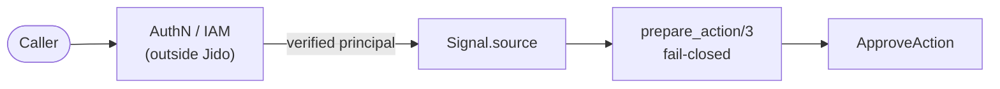

# Controlled-Agent Reference Application (`jido-e07-t35`)

The controlled-agent extension of the [long-running reference app][ref]. One
supervised `Jido.AgentServer` proves the full control path in a single run:
**who initiated work, what was allowed, what happened, and how failure was
handled** — and the design names every control element a production controlled
agent composes, even the ones this demo isolates in a focused demo and the ones
a sibling task builds out.

[ref]: ../long_running_reference/README.md

The agent is deterministic and side-effect free — no API key, network, or
runtime is required — so the whole path runs in a normal `mix test` process.

## The nine-element design

The [architecture spec][spec], "Controlled-agent extension", fixes nine control
elements. This demo implements the ones an integrated run can prove today and
points at where the rest live; the design layers all nine onto this same agent
rather than spawning a second one.

[spec]: ../../../../specs/operations-reference-architecture.md

| # | Element | Jido surface | In this demo | Where the rest is proven |
|---|---|---|---|---|
| 1 | Ingress | the incoming `Signal` | `ControlledAgent` routes `work.approve`; `IncomingContext` carries principal/tenant/request/correlation/causation (`jido-e07-t37`); `IngressPlugin` verifies/enriches them in `prepare_signal/2` (`jido-e07-t38`) | — |
| 2 | Principal context | `Signal.source` | every Signal carries the caller's `source`; the hook inspects it | `IncomingContext` (`jido-e07-t37`) |
| 3 | Policy | `prepare_action/3` | `AuthorizationPlugin` is **fail-closed** (`["alice"]`) | — |
| 4 | Actions | `Jido.Action` | `ApproveAction` advances the counter | — |
| 5 | Effects | typed Actions + AI tool/effect/quota policies | (designed; not wired here) | focused demos `AiToolAllowlist`, `QuotaControlAgent` |
| 6 | Journal | durable Signal Journal adapter | (designed; not wired here) | focused demo `DurableSignalJournal`; `jido-e07-t45` |
| 7 | Telemetry | `Jido.Observe` (+ `jido_otel`) | Signals carry correlation IDs; `CorrelatedTrace.run/1` joins principal → request → Signal → Action → policy result → effect for one unit of this agent's work into one trace (`jido-e08-t43`); `CorrelatedTelemetry.joined_trace/2` joins Agent → Signal → Action → tool → external-effect work into one trace (`jido-e07-t47`); `Redaction` keeps a defined fixture out of telemetry, logs, Journal entries, and error output (`jido-e07-t48`) | focused demos `CorrelatedTelemetry`, `RedactedAction` |
| 8 | Approval | an Action that gates a high-impact effect | (designed; not wired here) | focused demo `ApprovalBoundaryAgent` |
| 9 | Recovery | `AgentServer` under OTP supervision + persistence | `Supervisor` restarts the process; state recovers via hibernate/thaw | the four recovery boundaries in the long-running spec |

This demo implements elements 1–4 and 9; elements 5–8 are isolated in their
focused demos so each can be studied on its own, then layered back on here under
the sibling tasks named in the table.

## What this proves

| Control question | What this example proves |
|---|---|
| **Who initiated work** | Every `work.approve` Signal carries a `source` principal; the hook inspects it, so each piece of work is attributable to the caller, not the agent. |
| **What was allowed** | `AuthorizationPlugin.prepare_action/3` is fail-closed: the Action runs only when the principal is in the allowlist. Run as `mallory` and the Action never executes. |
| **What context was required** | `IngressPlugin.prepare_signal/2` validates the incoming context at the earliest hook: a malformed or missing required field stops the signal before routing, the policy hook, or the Action. Run with a malformed `tenant` (even as `alice`) and the Action never executes. |
| **What happened** | The `approved_count` counter and the control log record exactly what ran — approved work increments, denied work is rejected with a reason — and Signals carry correlation IDs you can follow. `CorrelatedTrace.run/1` joins those six elements (principal, request, Signal, Action, policy result, effect) for one unit of work on one correlation id (`jido-e08-t43`). |
| **How failure was handled** | The `AgentServer` runs under an OTP supervisor (`:permanent`, `max_restarts: 1000`). Crash it and supervision restarts a fresh process; approved state survives a full restart via hibernate/thaw. |

## Incoming context (`jido-e07-t37`)

An incoming controlled-agent Signal carries five context fields, defined once in
`IncomingContext`. Each field has a **source** (the Signal location it rides
on), a **validation rule**, and a **propagation test**
(`controlled_agent_incoming_context_test.exs`) — locked by the task's
acceptance: *each field has a source, validation rule, and propagation test.*

| field | source | validation rule |
|---|---|---|
| `principal` | `Signal.source` | required, non-empty binary |
| `tenant` | `Signal.extensions["tenant"]` | optional; when present, non-empty binary |
| `request` | `Signal.extensions["request_id"]` | optional; when present, non-empty binary |
| `correlation` | `Signal.extensions["correlation_id"]` | optional; when present, non-empty binary |
| `causation` | `Signal.extensions["causation_id"]` | optional; when present, non-empty binary |

```elixir
alias AgentJido.Demos.ControlledAgent.IncomingContext

attrs = IncomingContext.build(
  principal: "alice",
  tenant: "acme",
  request: "req-7",
  correlation: "trace-7",
  causation: "sig-cause-7"
)

signal = Jido.Signal.new!("work.approve", %{note: "x"}, attrs)
IncomingContext.validate(signal)   # => :ok
IncomingContext.get(signal, :principal)   # => "alice"
```

`principal` is the already-authenticated caller, verified at the boundary in
front of Jido (see [Authentication boundary](#authentication-boundary)). The
other four are application-supplied context that same boundary attaches;
`correlation` ties one unit of work across components and `causation` names the
signal or request that caused this one. This module carries and validates the
context — it does not verify identity (the boundary does) or authorize work (the
`AuthorizationPlugin` does). Wiring that validation onto the live path via
`prepare_signal/2` is the [Ingress gate](#ingress-gate-prepare_signal2) below.

## Ingress gate (`prepare_signal/2`)

`IngressPlugin` (`jido-e07-t38`) is the architecture spec's middle step — it
runs `IncomingContext.validate/1` in `prepare_signal/2`, the earliest Jido hook,
**before** routing, the policy hook (`prepare_action/3`), and the Action. The
controlled-agent linear path is: carry context on the incoming Signal →
verify/enrich it in `prepare_signal/2` → make `prepare_action/3` fail-closed
against a policy.

| outcome | what the gate does |
|---|---|
| **context valid** | returns `{:ok, signal, delta}`, where `delta[:incoming_context]` enriches later phases with the five verified fields |
| **context invalid or required field missing** | returns `{:error, {:invalid_context, {field, reason}}}`, which Jido turns into an error directive that **stops the signal before Agent processing** |

`field` is one of `IncomingContext.fields/0` and `reason` is `:missing` (a
required principal is absent) or `:malformed` (a present value is not a
non-empty binary). Only `principal` is required; the other four reject when
present-but-malformed. The gate does not authorize work (the `AuthorizationPlugin`
does) — it only checks that required context is present and well-formed, so a
malformed-context signal from an *allowed* principal is still stopped before the
Action runs. The acceptance is locked by `controlled_agent_ingress_test.exs`:
*Invalid or missing required context stops before Agent processing.*

## Authentication boundary

Authentication is a boundary **in front of** Jido, not something this agent (or
Jido) performs. The path has three stages, and only the middle one is Jido's:

| Stage | Owner | In this demo |
|---|---|---|
| **Authenticate** | application / platform (outside Jido) | the caller's identity is verified and a principal issued before the Signal exists |
| **Carry** | Jido | every `work.approve` Signal carries the caller on `Signal.source` |
| **Authorize** | application policy via Jido's hook | `AuthorizationPlugin.prepare_action/3` allows `alice`, denies everyone else — fail-closed |



The allowlist (`["alice"]`) is the **Authorize** stage — a policy decision, not a
login. `alice` is a principal the boundary in front of Jido already
authenticated; the hook only decides whether that principal may run the Action.
**Jido does not authenticate a user or service by itself.** The spec's
[Authentication boundary][spec] section draws the same line, and
[security and governance](/docs/operations/security-and-governance) owns the full
claim-boundary model.

## One correlated operational trace (`jido-e08-t43`)

Element 7's acceptance for *this* agent — *principal context, request, Signal,
Action, policy result, and effect share documented correlation* — is proven by
`CorrelatedTrace.run/1`. It runs one unit of `work.approve` work through a real
supervised `ControlledAgent` and returns a single trace that joins the six
elements an operator follows, each stamped with the one correlation id seeded
from the incoming Signal:

| element         | source                                                |
|-----------------|-------------------------------------------------------|
| `principal`     | `Signal.source` — the already-authenticated caller    |
| `request`       | the `request_id` incoming-context field               |
| `signal`        | the routed `Signal.type`                              |
| `action`        | the route table's `Jido.Action` module                |
| `policy_result` | the fail-closed `AuthorizationPlugin` decision        |
| `effect`        | the state change the Action produced (or none)        |

The policy decision and the effect are **real**: the agent runs under its real
`AgentServer` with its real fail-closed hook, so the allowed path records
`:allowed` with a counter delta and the denied path records `{:denied,
:unauthorized}` with `:no_effect`. The whole unit of work is also emitted as one
`Jido.Observe` trace (the **observation backend**) whose six spans each carry the
shared `jido_trace_id`, so an operator — or a `jido_otel` exporter attached to
the same `:telemetry` events — follows one unit of work across all six elements.

```elixir
alias AgentJido.Demos.ControlledAgent.CorrelatedTrace

{:ok, allowed} = CorrelatedTrace.run(principal: "alice", request: "req-42")
allowed.correlation_id   # the id shared by all six legs
allowed.policy_result    # => :allowed
allowed.effect           # => %{approved_count: 1, delta: 1}

denied = CorrelatedTrace.run!(principal: "mallory")
denied.policy_result     # => {:denied, :unauthorized}
denied.effect            # => :no_effect
```

The acceptance is locked by `controlled_agent_correlated_trace_test.exs`: the six
elements share one correlation id for both the allowed and the denied path, and
every emitted observation span carries the same `jido_trace_id`.

## Recovery in this demo

Recovery has two layers here, matching the long-running spec's process and
application boundaries:

- **Process restart** — `Supervisor` boots the `AgentServer` `:permanent`; a
  killed process is restarted by the surviving supervisor. In-memory state is
  lost, so the counter resets — exactly what supervision recovers (the process)
  and what it does not (memory).
- **Application restart** — `controlled_agent_persistence_test.exs` checkpoints
  approved state via `Jido.Persist.hibernate/thaw` and restores it on a fresh
  boot, so `approved_count` survives a restart.

The node and deployment boundaries (durable, disk-backed state) are proven in
the [long-running reference app][ref]; the design carries the same semantics
here once a durable Journal and store are layered on.

## Run it

```
mix test test/agent_jido/demos/controlled_agent_test.exs
mix test test/agent_jido/demos/controlled_agent_persistence_test.exs
mix test test/agent_jido/demos/controlled_agent_incoming_context_test.exs
mix test test/agent_jido/demos/controlled_agent_ingress_test.exs
mix test test/agent_jido/demos/controlled_agent_redaction_test.exs
mix test test/agent_jido/demos/controlled_agent_correlated_trace_test.exs
```

The design coverage itself is locked by:

```
mix test test/agent_jido/demos/controlled_agent_design_test.exs
```

## Module map

```
controlled_agent/
├── controlled_agent.ex     # the agent: state schema, signal route, ingress + authorization plugins
├── incoming_context.ex     # the five incoming-Signal context fields (sources + rules)
├── ingress_plugin.ex       # prepare_signal/2 verify/enrich gate (the ingress)
├── authorization_plugin.ex # fail-closed prepare_action/3 (the policy)
├── approve_action.ex       # the protected Action
├── correlated_trace.ex     # one trace joining principal/request/signal/action/policy/effect (jido-e08-t43)
├── redaction.ex            # redacts a defined fixture across the four operational-data sinks
└── supervisor.ex           # the process-restart boundary
```

## Key concept

**The hook is an integration point, not an IAM product.** Jido does not
authenticate callers. Verified identity is established at the authentication and
IAM boundary you put in front of Jido, and the principal it issues is what each
incoming Signal carries. The hook decides whether that principal may run the
Action — your application supplies the policy decision. See
[security and governance](/docs/operations/security-and-governance) for the full
model, and the spec's [explicit non-goals][spec] for which duties stay outside
Jido.
