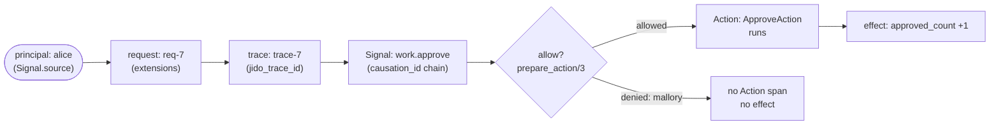

%{
  description: "How an operator follows one unit of work from a principal, request, trace, or Signal ID to the decisions that governed it and the effects it produced.",
  title: "Operator investigation runbook",
  category: :docs,
  legacy_paths: [],
  tags: [:docs, :operations],
  order: 381,
  control_types: [:identity_context, :authorization, :history, :observation, :approval],
  control_intent: :investigate,
  draft: false
}
---
# Operator Investigation Runbook

An investigation answers one question: **given a starting identifier, what was decided and what happened?** This runbook is the procedure an operator follows to answer it for a controlled-agent workload. You start from one of four identifiers — a principal, a request, a trace, or a Signal — and walk the same path in either direction until you reach the decisions that governed the work (allow/deny, approval, quota) and the effects it produced (the Action that ran, the tool it called, the external effect).

The path is real and testable. The identifiers are the ones the [controlled-agent reference application][ref] carries on every Signal, and the decisions and effects are the ones its plugins and Actions produce. The procedure below names, for each step, the Jido surface you read and the part your application owns.

[ref]: /docs/getting-started/operational-controls

## The two stores an investigation reads

An investigation reconstructs work from two stores. They are different things and an operator must keep them straight, because each answers a different half of the question.

| Store | What it is | Answers | What it is not |
|---|---|---|---|
| **Telemetry stream** | the `:telemetry` events `Jido.Observe` emits, optionally bridged to OpenTelemetry by `jido_otel` | *what happened, and how long it took* — the five-layer trace of Agent → Signal → Action → tool → effect | an audit log. It is an ephemeral, best-effort stream with no built-in retention and no tamper evidence. |
| **Durable Signal Journal** | the full Signal, recorded verbatim, when you configure an adapter | *the durable causal record* — who initiated work, which signal caused which, and the context each carried | retained, access-controlled, or tamper-evident by default. The default is **not durable**. |

Telemetry is for understanding; the Journal is for causal history. Neither is an audit-of-record — see [Telemetry and Traces](/docs/operations/telemetry-and-traces) and [Journal retention, access, and deletion](/docs/operations/journal-retention-access-and-deletion) for the full boundaries.

## The four entry identifiers

Pick the identifier you have. Each one rides on a known location on the Signal, so the same lookup works regardless of where you entered the chain. The four sections after this table walk each entry point; the two sections after those walk the outcomes — decisions and effects — you are walking toward.

| You have | Where it rides | First place to look |
|---|---|---|
| **Principal** | `Signal.source` (the already-authenticated caller) | filter the durable Journal by `source`; filter telemetry by `source` / `agent_id` |
| **Request** | `Signal.extensions["request_id"]` (one LLM request / unit of work) | the request's correlated spans; query the Journal by extension |
| **Trace** | `jido_trace_id` (the correlation id tying one unit of work across components) | the five-layer joined trace; every span carries the same `jido_trace_id` |
| **Signal** | the Signal id, with its `trace_id`, `span_id`, and `causation_id` | the durable Journal record for that id; follow `causation_id` up the chain |

## Start with a principal

A principal is the caller's identity, verified at the boundary **in front of** Jido and carried on `Signal.source`. To find every piece of work a principal initiated:

1. **Query the durable Journal by `source`.** `Jido.Signal.Journal.query/2` takes a `source` filter, so you select every recorded Signal that principal initiated. This is the durable record of *who started what*.
2. **Filter the telemetry stream by `source` (or `agent_id`).** Each span's metadata names the agent that owns the work; the Signal layer carries `source` and `signal_type`. This shows the work as it happened, span by span.

A principal identifies who initiated work. It is **not** a credential and it is never proof of identity — see [Security and Governance](/docs/operations/security-and-governance). Following a principal reconstructs their work; it does not authenticate them.

## Start with a request

A request id names one LLM request or unit of work. It rides on `Signal.extensions["request_id"]`, attached by the boundary in front of Jido. To follow a single request:

1. **Find the request's correlated spans.** The request lives in the `[:jido, :ai, :llm]` layer of the trace (the external-effect layer). Every span the request emits carries the same `jido_trace_id`, so the request ties back to the signal that caused it.
2. **Cross to the Signal that carried it.** The same `jido_trace_id` and `causation_id` join the request span to the Signal span above it, then to the Action and the agent that own the work.

A request id correlates work across components; it does not authorize it. Tie it back to the principal on `Signal.source` to see *who* made the request.

## Start with a trace

A trace id (`jido_trace_id`) ties one unit of work together across the whole observation path. It is seeded from the incoming Signal (`Jido.Tracing.Context.ensure_from_signal/1`) and carried by every span that work emits, alongside `jido_span_id`, `jido_parent_span_id`, and `jido_causation_id`. To read one trace:

1. **Collect every span carrying that `jido_trace_id`.** One unit of work passes through five layers, each with a canonical event prefix:

   | Layer | Event prefix |
   |---|---|
   | Agent | `[:jido, :agent, :cmd]` |
   | Signal | `[:jido, :agent_server, :signal]` |
   | Action | `[:jido, :agent, :action, :run]` |
   | Tool | `[:jido, :ai, :tool, :execute]` |
   | External effect | `[:jido, :ai, :llm]` |

2. **Read the tree, outermost first.** The agent owns the work; the signal delivers it; the action runs; the tool is invoked; the tool produces an external effect. That nesting *is* the unit of work, from owner to effect.

A trace id correlates work; it does not span nodes or external services on its own. A `:jido_trace_id` joins signals inside a run; an OpenTelemetry trace (via the optional `jido_otel`) spans processes and services. They are not the same identifier — see [Telemetry and Traces](/docs/operations/telemetry-and-traces).

## Start with a Signal

A Signal id names one event in the causal chain. Its `trace_id` joins it to the unit of work; its `causation_id` names the signal that caused it. To investigate one Signal:

1. **Read its durable Journal record.** When a Journal is configured, `Jido.Signal.Journal.query/2` returns the full Signal verbatim — `source`, `data`, `extensions`, `subject`, and the trace fields — so you see exactly what was carried.
2. **Follow `causation_id` up the chain.** Each Signal names the one that caused it, so you can reconstruct the sequence of decisions and effects that led to the signal you started from.

A Signal carries context but does not authenticate it. A `tenant_id` or `user_id` on a Signal is a claim about who the work is for, supplied and verified at the boundary in front of Jido — not proof the caller is that user or tenant.

## Find the decisions

Decisions are the control points that governed the work. Three decisions matter in an investigation, and each is observable:

- **Allow / deny.** The fail-closed `prepare_action/3` hook decides whether a principal may run the Action. An allowed Action emits an Action-run span and produces an effect; a denied one does neither — the absence of the Action span *is* the deny decision. The controlled-agent demo records the allow/deny outcome and its reason in a control log.
- **Approval.** A high-impact effect is gated behind an approval Action. The decision is whether the gate opened: the approval Action ran (and the gated effect followed) or it did not.
- **Quota.** The request, token, and tool budgets decide whether work proceeds or is bounded. The denial is observable — `:quota_exceeded` (token/request budget), `:busy` (in-flight pool), or `:max_iterations` (tool cap). See [Rate Limits and Cost Budgets](/docs/operations/rate-limits-and-cost-budgets).

Decisions are application-owned policy expressed through Jido's hooks, not a built-in RBAC product. The hook is the integration point; the *decision* is yours.

## Find the effects

Effects are what the work did. They live in the lower layers of the trace, and each is a span you can read:

- **The Action ran.** The `[:jido, :agent, :action, :run]` span records the Action and its result. If an effect already ran and you need to reconcile it, use the durable Signal Journal and idempotency to replay safely.
- **A tool was invoked.** The `[:jido, :ai, :tool, :execute]` span names the tool and its arguments and result. Use the tool-call id and trace to see what went in and what came back.
- **An external effect was produced.** The `[:jido, :ai, :llm]` span records the model/provider call and its outcome (`:completed`, `:failed`, `:timeout`). A failed effect may have retried inside a bounded budget or fallen back — follow the trace to see which.

## A worked walkthrough

The controlled-agent reference application is a single supervised `Jido.AgentServer` that proves this path end to end in a normal `mix test` run. Follow one unit of work through it:

- **Start with the principal `alice`.** The Journal's `source` filter returns her `work.approve` signals; telemetry shows her agent's spans.
- **Follow the request `req-7`.** The request extension joins the signal to the external-effect layer.
- **Follow the trace `trace-7`.** One `jido_trace_id` carries through agent, signal, action, and effect.
- **Find the decision.** `alice` is in the allowlist, so the Action runs — the Action-run span is present and `approved_count` increments. Run the same path as `mallory` and the policy denies: there is no Action span and no effect. Run it as `alice` with a malformed `tenant` and the ingress gate stops the signal before the policy or Action ever run.

The worked example is real and runnable — its modules and tests are in the repository:

- Reference application: `lib/agent_jido/demos/controlled_agent/` (the agent, ingress gate, fail-closed policy, and protected Action).
- Correlated five-layer trace: `lib/agent_jido/demos/correlated_telemetry/correlated_telemetry.ex` and `test/agent_jido/demos/correlated_telemetry_test.exs`.
- Incoming-context fields and their sources: `test/agent_jido/demos/controlled_agent_incoming_context_test.exs`.
- Allow/deny, ingress-gate, and redaction behavior: `test/agent_jido/demos/controlled_agent_test.exs`, `controlled_agent_ingress_test.exs`, and `controlled_agent_redaction_test.exs`.

## Honesty points

An investigation reconstructs what happened from the two stores above. It does not, by itself:

- **Authenticate anyone.** Identifiers are correlation, not credentials. Following a principal or trace reconstructs work; it never proves identity — see [Security and Governance](/docs/operations/security-and-governance).
- **Guarantee a complete record.** Telemetry is best-effort and may drop events under load; the durable Journal records only what you configured it to (the default is not durable). A gap in either store is possible.
- **Attest to integrity.** Neither store is tamper-evident. The Journal is mutable causal-history storage, not an append-only audit trail — a tamper-evident audit store is an explicit non-goal and an application-owned layer.
- **See redacted fields.** Redaction rules keep secrets, prompts, and principal data out of telemetry, Journal entries, logs, and error output. You follow the structure of the work even when the sensitive contents are masked.
- **Correlate across stores unless you propagate context.** Joining a principal to a request to a trace to a Signal works only because the ingress gate carries and validates principal/tenant/request/correlation/causation context on every incoming Signal. If a workload does not propagate that context, the joins break.

## Next steps

- Draw the full identity, authorization, audit, and observability boundaries in [Security and Governance](/docs/operations/security-and-governance).
- Separate the two stores this runbook reads in [Telemetry and Traces](/docs/operations/telemetry-and-traces) and [Journal retention, access, and deletion](/docs/operations/journal-retention-access-and-deletion).
- Practice responding when a control fires in [Incident playbooks](/docs/operations/incident-playbooks).
- Confirm every store and control this runbook assumes is wired up with the [Production Readiness Checklist](/docs/operations/production-readiness-checklist).
- Build the controls end to end from the [Operational controls](/docs/getting-started/operational-controls) onboarding lane.
